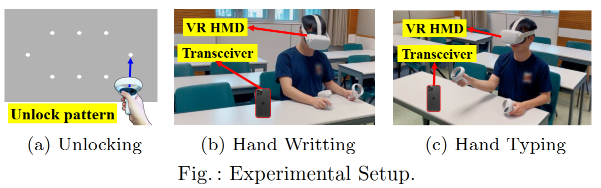
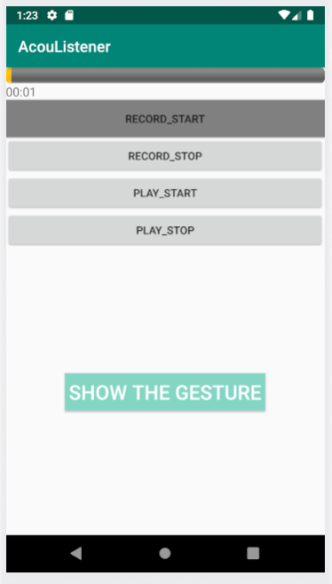
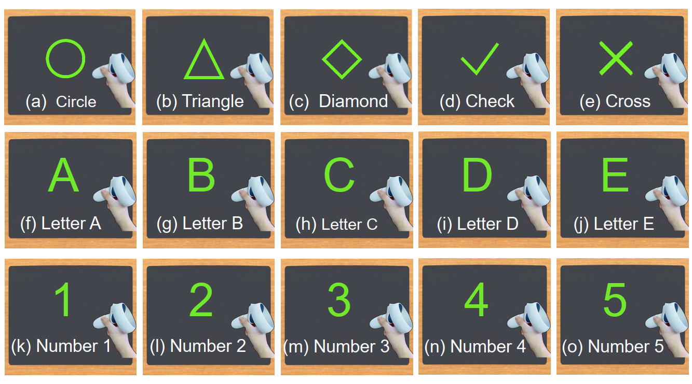

# AcouListener: An Inaudible Acoustic Side-channel Attack on Augmented and Virtual Reality Systems
Although diverse augmented reality (AR) and virtual reality (VR) systems have garnered extensive attention from both industry and academia, they have also raised increasing security and privacy concerns. AR/VR devices, equipped with various sensors, can continuously collect sensitive human data and track users, making them targets for malicious attacks. To better understand the threats posed by the acoustic channel in AR/VR systems, we investigate a novel concealed side-channel attack that utilizes inaudible acoustic signals transmitted and detected by commercial off-the-shelf VR headsets or mobile phones. From the received variations in the acoustic channel caused by a VR victim's hand movements, unique features can be extracted to reconstruct the input contents (e.g., passwords). We refer to this attack system as AcouListener, implemented as a camouflaged mobile app that can be installed on either an AR/VR or a mobile platform. We conduct extensive experiments targeting three common VR attack scenarios: (1) inferring victims' unlocking patterns, (2) inferring victims' handwriting patterns, and (3) inferring victims' typing words and passwords in virtual keyboards. Experimental results show that AcouListener achieves an average F1-score of 84% in unlocking pattern recognition, 95% in handwriting recognition, and 80% in typing recognition. Furthermore, we present corresponding countermeasures against this inaudible acoustic side-channel attack.

# Experimental Setup
- ## Hardware devices
  * VR device: Oculus Quest 2
  * Mobile phone: Honor X10 and iPhone 12 pro

- ## Attack Scenario
  * Scenario 1: Unlocking Pattern Inference
  * Scenario 2: Hand-Written Content Inference
  * Scenario 3: Hand Typing Inference

# Data Collection
- ## Experiment Setup
In the attack scenarios, a volunteer sits on a chair in front of the desk, wears an Oculus Quest 2 HMD, holds the controllers in both hands, and makes corresponding hand movements. At the same time, a mobile phone was adopted to emit and receive corresponding inaudible audio and capture the volunteers’ hand movements. 

- The length of the collected audio is 5 seconds. The data can all be found at:
`cd /dataset/audio_dataset`  

- Once the data collection is completed, the next step is to pre-process the data. Convert the collected audio into a CIR image. The calculation script can be found in:
`cd /dataset/audio_dataset`  

- The processed cir data can all be found at:
`cd /dataset/cir_dataset`  

- With the collected data, CNN models for recognizing gestures can be trained. Models trained based on different scene data can recognize gestures suitable for the requirements of the scene. The Script for training CNN models can all be found at:
`cat /cnn_model/train_cnn.py`  

# AcouListener
## Introduction
We have developed an Android based application, namely AcouListener. This application can transmit training audio at an inaudible frequency band, collect audio, and calculate CIR in attack scenarios. Subsequently, through a built-in network model trained specifically for the attack scenario, the application is able to recognize the corresponding gestures.

## Features
1. **RECORD_START Button**: Initiates the audio recording process and starts recording.
2. **RECORD_STOP Button**: Stops the audio recording and saves it locally.
3. **PLAY_START Button**: Begins playing the training audio above 18 kHz.
4. **PLAY_STOP Button**: Stops playing the training audio.
5. **SHOW THE GESTURE Button**: Displays the recognized gesture.

## Instructions
1. Click the **PLAY_START Button** to start playing the training audio.
2. Click the **RECORD_START Button** to start collecting data for calculating the cir that records gesture information.
3. Click the **RECORD_STOP Button** to end the recording and complete data collection.
4. Click the **PLAY_STOP Button** to stop playing the training audio.
5. Click the **SHOW THE GESTURE Button** Shows the gesture recognized based on cir.

## App Development
For different scenarios, the application framework remains unchanged. Only the corresponding trained recognition network model needs to be replaced. The software code only needs to be imported into Android Studio to compile and generate the corresponding APK. 

- The code of the app framework can be found: at: `cd /AcouListener`  

- The path to replace the model is: `cd /AcouListener/app/src/main/assets`  

- We provide a model trained on data collected for the attack scenarios 2 for reference, with the path at: `cd /cnn_model/save_mode`  

- We have provided an APK based on Scenario 2 for reference. It is suitable for attack scenario 2 and can recognize 15 gestures. The download address is at: `cd /AcouListener/app/build/outputs/apk/debug`  

